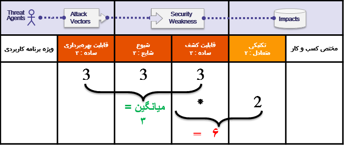

# 
+R یادداشتی در مورد ریسک ها
  

## 
این بخش درباره ریسک هایی است که از ضعف ها نشات میگیرند.

روش رتبه بندی ریسک Top 10 بر پایه <a href="https://www.owasp.org/index.php/OWASP_Risk_Rating_Methodology">روش رتبه بندی ریسک OWASP</a> است. برای هر دسته TOP 10 ما ریسک نوعی ریسک را که هر ضعف یک برنامه تحت وب را معرفی می‌کند با نگاه به فاکتورهای احتمال و تاثیر برای هر ضعف متداول. سپس ما TOP 10 را بر اساس آن ضعف‌ها که به صورت نوعی مهم‌ترین ریسک برای یک برنامه را مشخص می‌کند، مرتب می‌کنیم. این فاکتورها با هر بار انتشار جدید TOP 10 به‌روز می‌شوندچون همه چیز تغییر می‌کند و تکامل می‌یابد.

<a href="https://www.owasp.org/index.php/OWASP_Risk_Rating_Methodology">روش رتبه بندی ریسک OWASP</a> فاکتورهای متعددی برای کمک به محاسبه ریسک یک برنامه شناخته شده ارائه می‌کند. اگرچه TOP 10 بیشتر درباره کلیات صحبت می‌کند تا آسیب‌پذیر‌ی‌های خاصی در برنامه‌های واقعی و APIها. در نتیجه ما هیچ وقت نمی‌توانیم به اندازه صاحب یا مدیر یک برنامه دقیق باشیم وقتی که برای برنامه‌(ها)ی آنها ریسک را محاسبه می‌کنیم. شما بهترین فرد برای قضاوت درباره اهمیت برنامه‌ها و داده‌هایتان هستید، تهدید‌های شما چه هستند و چگونه سیستم شما ساخته شده است و کار می‌کند.

روش ما شامل سه فاکتور احتمالی برای هر آسیب‌پذیری است (شیوع، قابلیت تشخیص و سادگی بهره‌جویی) و یک فاکتور تاثیر (تاثیر فنی). مقلیس ریسک برای هر فاکتور در بازه کم-1 تا زیاد-3 قرار دارد همراه با واژه‌شناسی برای هر فاکتور تعیین شده. شیوع یک آسیب‌پذیری فاکتوری است که معمولا لازم نیست محاسبه شود. برای داده شیوع ما آماری از شرکت‌های مختلف تهیه کرده‌ایم (که در بخش تقدیر و تشکر در صفحه 25 آورده شده است) و ما داده‌های آنها را باهم تجمیع کردیم تا با لیست احتمال TOP 10 منطبق شود. این داده‌ها بعدا با فاکتور‌های احتمالی دیگری (قابلیت تشخیص و سادگی بهره‌جویی ) ترکیب شد تا رتبه احتمالی هر آسیب‌پذیری محاسبه شود. رتبه بندی احتمال بعدا با ضرب در تخمین میانگین تاثیرفنی برای هر آیتم محاسبه می‌شود تا به طور کلی با رتبه‌بندی ریسک برای هر آیتم در TOP 10 (نتیجه بالاتر به معنی ریسک بالاتر است) همراه باشد. قابلیت تشخیص، سادگی بهره‌جویی و تاثیر از آنالیز گزارش‌های CVE که با هر دسته TOP 10 ترکیب شده است محاسبه شده است.

<strong>توجه : </strong>این دیدگاه درباره احتمال عامل تهدید به یک حساب کاربری صحبت نمی کند. و همچنین هیچکدام از جزئیات دقیق در ارتباط با یک برنامه ی خاص را به حساب نمی آورد.هرکدام از این فاکتورهای میتوانند به صورت ویژه احتمال کلی اینکه یک مهاجم یک آسیب پذیری خاص را محاسبه کرده و از آن سو استفاده کند.این امتیازدهی تاثیر واقعی روی کسب و کار شما را به حساب نمی آورد.سازمان شما باید تصمیم بگیرد که چه مقدار خطر امنیتی از برنامه ها و API  ها را میتواند بپذرید ، با توجه به فرهنگ شما ، صنعت و محیط . هدف OWASP TOP 10  این نیست که آنالیز این خطرها را برای شما انجام دهد.

 در ادامه توضیح محاسباتی ما برای ریسک در مورد<strong> A6:2017- تنظیمات امنیتی اشتباه</strong>. را خواهیم داشت.

